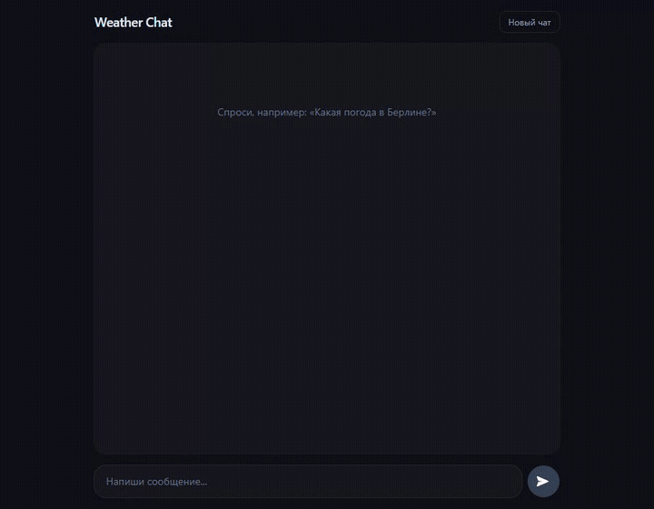

# Weather Chat — LangGraph + FastAPI + React

AI-чатбот: LangGraph-агент вызывает тул `get_weather`, бэк отдаёт по SSE
одновременно **текстовый ответ** и **structured `ui_event`**. Фронт рендерит
погодную карточку как нативный React-компонент поверх чата.



## Стек

- **Backend:** FastAPI, LangGraph, langchain-openai (LLM через OpenRouter),
  OpenWeatherMap, стриминг SSE (`StreamingResponse`), `AsyncSqliteSaver`
  для персистентности истории. Пакетник — `uv`.
- **Frontend:** React + Vite + TypeScript + Tailwind. Парсинг SSE через
  `fetch` + `ReadableStream`. Markdown — `react-markdown` + `remark-gfm`.
- **Память:** история чата хранится в `chat.db` (SQLite), `thread_id` — в
  `localStorage` браузера. При рестарте бэка и перезагрузке страницы история
  не теряется. Контекст для LLM обрезается `trim_messages` (последние N).

## Запуск (2 команды)

```bash
cp .env.example .env   # вписать OPENROUTER_API_KEY и OPENWEATHER_API_KEY
docker compose up --build
```

- Фронт: <http://localhost:5173>
- Бэк:   <http://localhost:8000>

## Локальный dev без Docker

```bash
# backend
cd backend
uv sync
uv run uvicorn app.main:app --reload

# frontend
cd frontend
npm install
npm run dev
```

## SSE-протокол `POST /chat`

Request:

```json
{ "message": "Какая погода в Берлине?", "thread_id": null }
```

События:

- `meta` — `{ "thread_id": "..." }` — клиент сохраняет в `localStorage`
- `token` — дельта текстового ответа LLM
- `ui_event` — `{ "type": "weather_card", "payload": { city, temp, ... } }`
- `done` — конец стрима

## Прочие эндпоинты

- `GET  /history/{thread_id}` — отдаёт сообщения треда в формате фронта
- `DELETE /history/{thread_id}` — удаляет тред (кнопка «Новый чат»)
- `GET  /health`

## Переменные окружения

См. `.env.example`:

- `OPENROUTER_API_KEY` — ключ OpenRouter
- `OPENROUTER_MODEL` — модель (по умолчанию `openai/gpt-4o-mini`; любая с
  поддержкой tool calling)
- `OPENWEATHER_API_KEY` — ключ OpenWeatherMap
- `CHAT_DB_PATH` — путь к SQLite-файлу (в docker — `/data/chat.db`)
- `MAX_HISTORY_MESSAGES` — лимит сообщений в контексте LLM (20)

## Логи

По умолчанию пишутся в stdout контейнера (в dev — дублируются в
`backend/logs/agent.log` для удобства). В docker смотреть так:

```bash
docker compose logs -f backend
```

Каждый запрос в логах выглядит так:

```text
[api]   POST /chat thread=... msg='Какая погода в Берлине?'
[agent] [model] вход: 2 сообщений
[httpx] POST openrouter.ai/api/v1/... 200
[agent] [model] tool_calls: [('get_weather', {'city': 'Berlin'})]
[agent] [tool]  вызов get_weather({'city': 'Berlin'})
[httpx] GET openweathermap.org/... 200
[agent] [tool]  результат: {"city":"Берлин","temp":16,...}
[agent] [model] вход: 4 сообщений
[agent] [model] ответ: 'Сейчас в Берлине ясно, около 16°C.'
```
